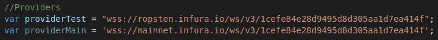
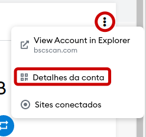
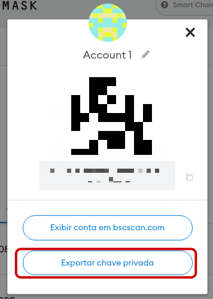
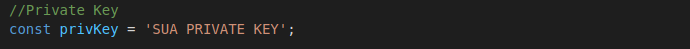

# ASMODEUS SERVER

<p>Asmodeus server é um projeto de meus estudos sobre blockchain, é basicamente um servidor que fica observando uma determinada wallet, e assim que algum valor (suficiente para ser transacionado) é recebido, imediatamente é redirecionado/transacionado para outra wallet.
É importante lembrar que nesse processo é consumido o fees/gas normalmente, como qualquer transação na devida rede blockchain. 
 O Asmodeus server é feito com base no projeto default do ExpressJS e realiza as ações na blockchain através da biblioteca Web3.
Aqui eu mostro um rápido tutorial de configuração do servidor para Ethereum, mas o mesmo processo pode ser utilizado para o servidor BNB, mas o websocket deste, por vezes se encontra fora do ar.</p>

## Preparando o ambiente

<p>Você precisa instalar algumas coisas antes de começar a mexer no projetos, são elas:</p>

- NodeJS
- NPM
- GIT (recomendado)

Se estiver no linux, você pode instala-los usando

```
sudo apt install node
sudo apt install npm
sudo apt install git
```

Todos os pacotes npm necessários já estarão instalados, sendo eles o Express (e outros relacionados ao servidor) e o Web3 que efetivamente  faz as transações e etc.

## Redes

Por default o Asmodeus já vem com a rede Ethereum/SmartChain configuradas, e também suas respectivas redes de testes. Note que caso você pretenda criar um projeto real, você deve trocar as redes Infura que estão configuradas no projeto, pelo link de um projeto seu. Crie uma conta na [Infura](https://infura.io) e substitua as URLs abaixo pelas suas. Os links default devem ser utilizados apenas para testes, não me responsabilizo por eventuais perdas.




## Configurando e iniciando

Primeiramente você deve fazer o download do projeto, usando:

```
git clone https://github.com/EuDavidReis-ODev/asmodeus-server.git
```

Ou se preferir pode baixar o projeto em zip: [projeto.zip](https://github.com/EuDavidReis-ODev/asmodeus-server/archive/refs/heads/main.zip)

Após baixar o projeto em seu computador, você precisa configurar o servidor com as seguintes informações:

- Endereço da carteira inicial: Endereço da carteira que será observada.
- Endereço da carteira destino: Endereço da carteira para onde pretende enviar o valor.
- Private Key da carteira inicial: A chave privada (Private Key) da wallet a ser observada. É com ela que você irá assinar a transação a ser enviada.

<h4>IMPORTANTE NUNCA COMPARTILHE SUA PRIVATE KEY COM NINGUÉM, ELA DEVE SER DE POSSE EXCLUSIVAMENTE SUA.</h4>


<h4>1.Endereços</h4>

<p>Primeiro edite as variáveis que irão guardar os endereços, procure e sobrescreva com a sua configuração no arquivo ASMODEUS_v1.5.js, conforme mostra a imagem abaixo:</p>


<h4>2.Private Key</h4>

<p>Agora com sua wallet inicial, a carteira que esta sendo observada, você precisa gerar uma private key, que é um hash que lhe permite assinar transações confirmando a sua identidade. Para este tutorial irei utilizar como demonstração a Metamask, mas você pode escolher a wallet que quiser.
Após logar no Metamask (realmente espero que você já saiba como fazer isso), clique nos três pontinhos e depois em Detalhes da conta</p>



Depois clique em exportar chave privada



Você terá que fornecer sua senha da Metamask e pronto, agora você só precisa colar sua chave na variável que é mostrada abaixo (no mesmo arquivo do passo 1):




## Rodando o servidor

<p>Agora basta você entrar na pasta do projeto e executar o NodeJS com o comando:</p>

```
node bin/www
```

E se tudo estiver correto, o servidor já estará funcionando


# Atenção

<p>Utilize os RPCs de testes para que não gaste nenhum valor real de sua carteira, também recomendo usar uma carteira sem nenhum valor real, pelo menos enquanto testa o servidor. Não compartilhe com ninguém sua chave privada e seed phrase, é sua responsabilidade mante-las seguras.
Em caso de dúvidas entre em contato comigo através do email: eudavidreis.dev@gmail.com</p>


### Sinta-se livre para aprimorar o código.